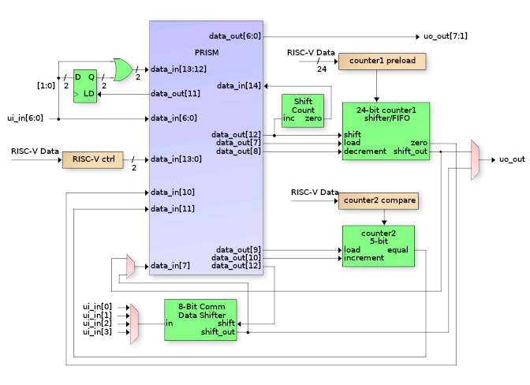
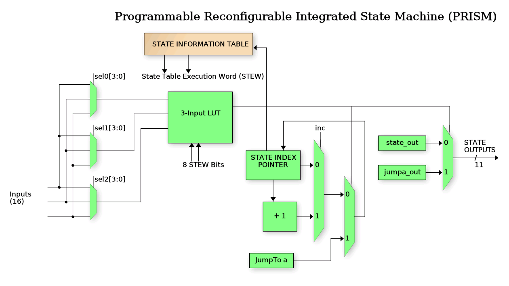

<!---

This file is used to generate your project datasheet. Please fill in the information below and delete any unused
sections.

You can also include images in this folder and reference them in the markdown. Each image must be less than
512 kb in size, and the combined size of all images must be less than 1 MB.
-->

## What it does

This is a Programmable Reconfigurable Indexed State Machine (PRISM) that executes a Verilog coded
state machine that is loaded via a configuration bitstream at runtime.

## Block diagram
The following is a top level diagram of the PRISM Peripheral.

The PRISM controller itself is a programmable state machine that uses an N-bit (3 in this case)
index register to track the current FSM state.  That index is a pointer into the State Information Table (SIT)
to request the State Execution Word (STEW).  The following is a block diagram of the PRISM controller:

## Register map

Document the registers that are used to interact with your peripheral

| Address | Name  | Access | Description                                                         |
|---------|-------|--------|---------------------------------------------------------------------|
| 0x00    | CTRL  | R/W    | Control register - see [CTRL Register](#ctrl-register-0x00) below |
| 0x04    | DBG_CTRL | W | Debug control |
| 0x0C    | DBG_STAT | W | Debug status |
| 0x10    | CFG_LSB | W | Config LSB register (write second) |
| 0x14    | CFG_MSB | W | Config MSB register (write first) |
| 0x18    | HOST_DATA | R/W | Host data register - see [HOST_DATA Register](#host_data-register-0x18) |
| 0x19    | FIFO_DATA | R | FIFO read data register - see [HOST_DATA Register](#host_data-register-0x18) |
| 0x1A    | FIFO_STAT | R | FIFO status register - see [HOST_DATA Register](#host_data-register-0x18) |
| 0x1B    | HOST_IN | R/W | Host input register - see [HOST_DATA Register](#host_data-register-0x18) |
| 0x20    | COUNT_CFG | R/W | Counter config register - see [COUNT_CONFIG Register](#count_config-register-0x20) |
| 0x24    | COUNT_VAL | R | Counter values register - see [COUNT_VALUES Register](#count_values-register-0x24) |
| 0x34    | DECISION_TREE | R | Decision tree data register |
| 0x38    | OUTPUT_DATA | R | Output data register |
| 0x3C    | INPUT_DATA | R | Input data register |

### Bit-field Details

#### CTRL Register (0x00)

| Bit(s) | Name | Description |
|--------|------|-------------|
| 31 | Interrupt clear | Write 1 to clear interrupt |
| 30 | PRISM enable| Enable/disable PRISM executino |
| 23 | ui_in[7] | Direct read of ui_in bit 7 |
| 22-16 | latched_out | Latched output values |
| 13 | latch5 | Use prism_out[5] to latch inputs |
| 12 | count2_dec | Enable count2 decrement mode |
| 11 | fifo_24 | Enable 24-bit FIFO mode |
| 10 | shift_24_en | Enable 24-bit shift mode |
| 9 | shift_dir | Shift direction (0=left, 1=right) |
| 8 | shift_en | Enable shift operations |
| 7 | latch_in_out | Latch input/output mode |
| 6-4 | cond_out_sel | Conditional output selection |
| 3-2 | shift_out_sel | Shift output selection |
| 1-0 | comm_in_sel | Communication input selection |

#### DBG_CTRL Register (0x04)

| Bit(s) | Name | Description |
|--------|------|-------------|
| 13-11 | new_si_val | New state index to set |
| 10 | new_si | Set to 1 to set new state index |
| 9-7 | bp1 | Breakpoint 1 state index |
| 6-4 | bp0 | Breakpoint 0 state index |
| 3 | bp1_en | Enable breakpoint 1 |
| 2 | bp0_en | Enable breakpoint 0 |
| 1 | single_step | Toggle 1->0 to single step PRISM |
| 0 | halt_req | Set to 1 to halt the PRISM |

#### DBG_STAT Register (0x0C)

| Bit(s) | Name | Description |
|--------|------|-------------|
| 8-7 | break_active | Which breakpoint is active |
| 6 | debug_halt | Indicates if PRISM is halted |
| 5-3 | next_si | Next state index to jump to |
| 2-0 | curr_si | Current state index |

#### HOST_DATA Register (0x18)

| Bit(s) | Name | Description |
|--------|------|-------------|
| 31-26 | Reserved | Reserved bits |
| 25-24 | host_in | Host input data |
| 23-21 | Reserved | Reserved bits |
| 20-19 | fifo_rd_ptr | Reserved bits |
| 19-18 | fifo_wr_ptr | Reserved bits |
| 17 | fifo_full | FIFO full status |
| 16 | fifo_empty | FIFO empty status |
| 15-8 | fifo_rd_data | FIFO read data |
| 7-0 | comm_data | Communication data |

#### FIFO_READ Register (0x19)

Byte-mode access of the 3-byte RX FIFO.  A byte read from this address will "pop" the byte from the fifo, incrementing the read point, updating the FULL / EMPTY flags, etc.

#### FIFO_STATUS Register (0x1a)

Byte-mode access of the RX FIFO status.

| Bit(s) | Name | Description |
|--------|------|-------------|
| 31-26 | Reserved | Reserved bits |

#### COUNT_CONFIG Register (0x20)

| Bit(s) | Name | Description |
|--------|------|-------------|
| 31-24 | count2_compare | Compare value for 8-bit count2 |
| 23-0 | count1_preload | Preload value for 24-bit count1 |

#### COUNT_VALUES Register (0x24)

| Bit(s) | Name | Description |
|--------|------|-------------|
| 31-24 | count2 | Current value of 8-bit counter |
| 23-0 | count1 | Current value of 24-bit counter |

#### DEBUG_OUT Register (0x30)

| Bit(s) | Name | Description |
|--------|------|-------------|
| 31-0 | debug_output_bits | Debug output bits from PRISM state machine |

#### DECISION_TREE Debug Register (0x34)

| Bit(s) | Name | Description |
|--------|------|-------------|
| 31-0 | decision_tree_data | Decision tree data including compare matches and LUT inputs |

#### OUTPUT_DATA Debug Register (0x38)

| Bit(s) | Name | Description |
|--------|------|-------------|
| 31-11 | Reserved | Reserved bits |
| 10-0 | out_data | Current output data from PRISM state machine |

#### INPUT_DATA Debug Register (0x3C)

| Bit(s) | Name | Description |
|--------|------|-------------|
| 31-16 | Reserved | Reserved bits |
| 15-0 | in_data | Current input data to PRISM state machine |

## How to test

1.  First define a Chroma ... a Finite State Machine with inputs and outputs.  See examples in chromas directory.
2.  Write Verilog to describe your FSM in Mealy format.
3.  Be sure to specify the Control Word Mux and options bit settings within the Verilog for things like:
    shift_en:    Enable shifter mode in either comm_data or 24-bit count1
    shift_24_en: Specify if shift is comm_data or count1
    shift_dir:   Set left or right shift direction
    fifo_24:     Use 24-bit count1 as RX FIFO
    etc.
4.  Clone and build the custom Yosys branch for generating PRISM bitstreams.  The Makefile in the chromas directory has a 'make yosys' target for cloning and building this from github sources.
5.  Generate a bitstream using the custom build version of Yosys that supports PRISM.  If you put your chroma in the 'chromas' directory and follow the naming convention, simply typing 'make' within that directory will build your chroma.  Results appear in the 'output' directory.
6.  Copy the generated chroma programming words and ctrl_reg value from either the .py or .c file (dependig on your test mode).
7.  Call the "load_chroma" function passing in the chroma bitstream array and ctrl_reg value generated by Yosys.
8.  The chroma should start running immediately.

## External hardware

No external HW required other than anything custom you might want to control from the programmable FSM.
