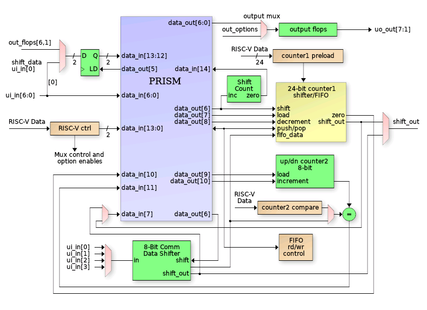
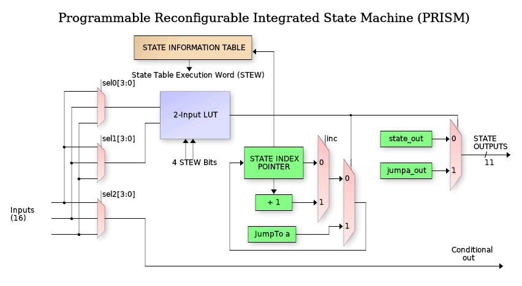

<!---

This file is used to generate your project datasheet. Please fill in the information below and delete any unused
sections.

You can also include images in this folder and reference them in the markdown. Each image must be less than
512 kb in size, and the combined size of all images must be less than 1 MB.
-->

## What it does

This is a Programmable Reconfigurable Indexed State Machine (PRISM) that executes a Verilog coded
state machine that is loaded via a configuration bitstream at runtime.

## Block diagram
The following is a top level diagram of the PRISM Peripheral.

The PRISM controller itself is a programmable state machine that uses an N-bit (3 in this case)
index register to track the current FSM state.  That index is a pointer into the State Information Table (SIT)
to request the State Execution Word (STEW).  The following is a block diagram of the PRISM controller:

## Register map

Document the registers that are used to interact with your peripheral

| Address | Name  | Access | Description                                                         |
|---------|-------|--------|---------------------------------------------------------------------|
| 0x00    | CTRL  | R/W    | Control register - see [CTRL Register](#ctrl-register-0x00) below |
| 0x18    | HOST_DATA | R/W | Host data register - see [HOST_DATA Register](#host_data-register-0x18) below |
| 0x19    | FIFO_DATA | R | FIFO read data register - see [HOST_DATA Register](#host_data-register-0x18) below |
| 0x1A    | FIFO_STATUS | R | FIFO status register - see [HOST_DATA Register](#host_data-register-0x18) below |
| 0x1B    | HOST_IN | R/W | Host input register - see [HOST_DATA Register](#host_data-register-0x18) below |
| 0x20    | COUNT_CONFIG | R/W | Counter configuration register - see [COUNT_CONFIG Register](#count_config-register-0x20) below |
| 0x24    | COUNT_VALUES | R | Counter values register - see [COUNT_VALUES Register](#count_values-register-0x24) below |
| 0x10    | LOAD_CTRL | W | Load control register (latch_loader) |
| 0x14    | MSB_ENABLE | W | MSB enable register (latch_loader) |
| 0x28    | COUNT1_PRELOAD | W | Count1 preload register (gds peripheral) |

### Bit-field Details

#### CTRL Register (0x00)

| Bit(s) | Name | Description |
|--------|------|-------------|
| 31 | Interrupt clear | Write 1 to clear interrupt |
| 30 | PRISM reset | Reset the PRISM state machine |
| 29 | PRISM enable | Enable/disable PRISM execution |
| 28 | count2_dec | Enable count2 decrement mode |
| 27 | fifo_24 | Enable 24-bit FIFO mode |
| 26 | shift_24_en | Enable 24-bit shift mode |
| 25 | shift_dir | Shift direction (0=left, 1=right) |
| 24 | shift_en | Enable shift operations |
| 23 | latch_in_out | Latch input/output mode |
| 22-20 | cond_out_sel | Conditional output selection |
| 19-18 | shift_out_sel | Shift output selection |
| 17-16 | comm_in_sel | Communication input selection |
| 15-9 | Reserved | Reserved bits |
| 8 | ui_in[7] | Direct read of ui_in bit 7 |
| 7 | Reserved | Reserved bit |
| 6-0 | latched_out | Latched output values |

#### HOST_DATA Register (0x18)

| Bit(s) | Name | Description |
|--------|------|-------------|
| 31-26 | Reserved | Reserved bits |
| 25-24 | host_in | Host input data |
| 23-18 | Reserved | Reserved bits |
| 17 | fifo_full | FIFO full status |
| 16 | fifo_empty | FIFO empty status |
| 15-8 | fifo_rd_data | FIFO read data |
| 7-0 | comm_data | Communication data |

#### COUNT_CONFIG Register (0x20)

| Bit(s) | Name | Description |
|--------|------|-------------|
| 31-8 | count2_compare | Compare value for count2 |
| 7-0 | count1_preload | Preload value for 24-bit counter |

#### COUNT_VALUES Register (0x24)

| Bit(s) | Name | Description |
|--------|------|-------------|
| 31-8 | count2 | Current value of 8-bit counter |
| 7-0 | count1 | Current value of 24-bit counter |

## How to test

1.  First define a Finite State Machine with inputs and outputs.
2.  Write Verilog to describe your FSM in Mealy format.
3.  Generate a bitstream using the custom branch of Yosys that supports PRISM (use the provided config file).
4.  Replace the programming bitstream in the provided C code with your FSM bitstream.

## External hardware

No external HW required other than anything custom you might want to control from the programmable FSM.
